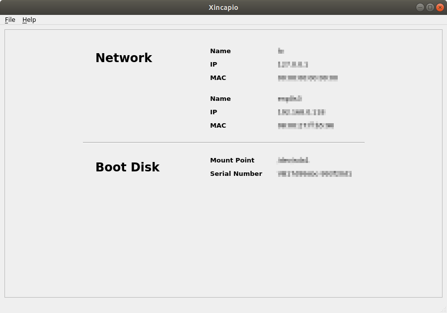
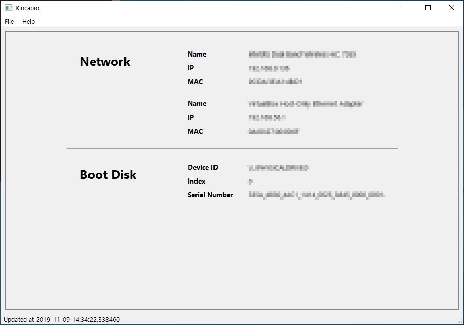

# Xincapio
Linux (Ubuntu)



-----

Windows 10



Xincapio is a cross-platform software to get IP address, MAC address and Disk Serial Number. It is developed in Python 3.7, and supports Graphical User Interface using PyQt5.

## Table of Contents
- [Installation](#installation)
- [Build from source](#build-from-source)
- [Usage](#usage)
- [Uninstallaion](#uninstallation)

## Installation

Download from [GitHub Releases](
    https://github.com/jbaltop/xincapio/releases/tag/v1.0.0
).

### Linux

Compiled and tested on Ubuntu 18.04.3.

```
$ tar xzvf xincapio.tar.gz
$ cd xincapio
$ ./install-xincapio
$ source "$HOME/.bashrc"
```

### Windows

Compiled and tested on Windows 10.

```
> xincapio-installer.exe
```

## Build from source
Please refer to [BUILD](./BUILD.md).

## Usage

### GUI

#### Linux

```
$ xincapio --gui
```

#### Windows
`Start > Xincapio > Xincapio`

### Console

#### Linux

```
$ xincapio
$ xincapio --help
$ xincapio --output <path-to-output-file>
$ xincapio --version
```

#### Windows

```
> cd "C:\Program Files\xincapio" 
> .\main.exe
> .\main.exe --help
> .\main.exe --output <path-to-output-file>
> .\main.exe --version
```

## Uninstallation

### Linux

```
$ uninstall-xincapio
```

If something went wrong with `~/.bashrc`, restore from `~/.bashrc.bak`.

### Windows

`Control Panel > Programs > Programs and Features >> Xincapio > Uninstall`
